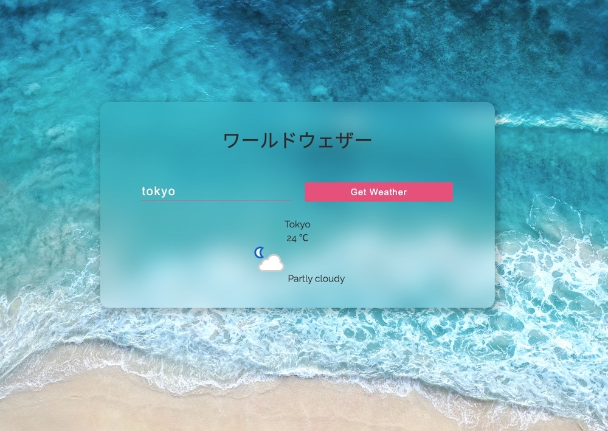

# React TypeScript Weather App

[https://lighthearted-cucurucho-255f70.netlify.app/](https://lighthearted-cucurucho-255f70.netlify.app/)

## Description
以下の書籍を参考に作った学習用リポジトリです。

[「はじめてつくるReactアプリ with TypeScript」](https://amzn.to/3NScPsa) by [三好アキ](https://amzn.to/3Pc6V67)

## Technologies

- React v18
- TypeScript v4

## Set up

```
cd react_typescript_quiz_app
npm install
npm start
```

## Capture


